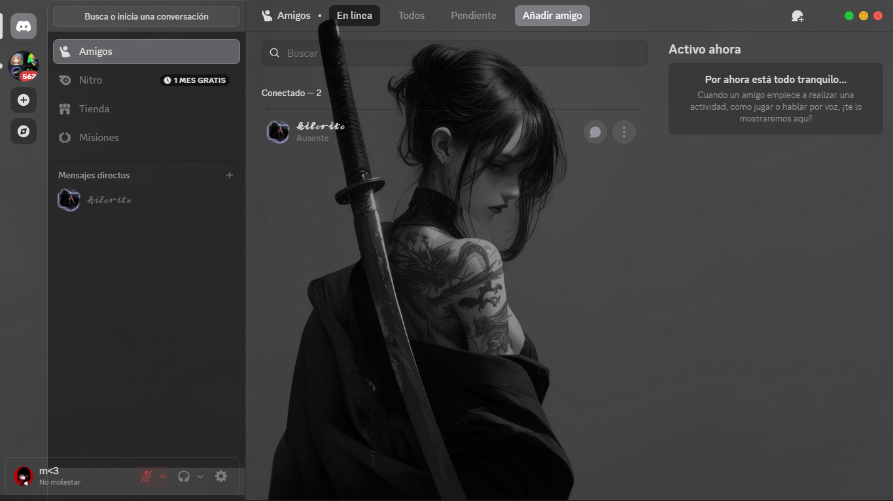

# ⚔️ Katana Girl — Discord Theme

<div align="center">


**Un tema transparente, minimalista y refinado con estética *Glassmorphism* para Discord.**  
Optimizado para el nuevo diseño *Visual Refresh*, con botones de ventana circulares estilo Linux/macOS, panel de configuración intuitivo y limpieza visual total.

[Instalación](#-instalación) • [Características](#-características) • [Personalización](#-personalización) • [Compatibilidad](#-compatibilidad)

---

</div>

## 🖼️ Vista Previa

<div align="center">
  
</div>

---

## ✨ Características Principales

- 🪟 **Estética Glassmorphism Premium**: Efecto de cristal esmerilado (`backdrop-filter: blur`) en canales, paneles de voz, barra de búsqueda y lista de amigos.
- 🔴🟡🟢 **Botones de Ventana Integrados**: Botones circulares estilo semáforo (Minimizar verde, Maximizar amarillo, Cerrar rojo) incrustados limpiamente en la cabecera sin superposición de capas (*Stacking Context Fix*).
- 🧹 **Interfaz Ultra Limpia**:
  - Oculta etiquetas molestas de *"NUEVO"* en servidores, canales, tienda y nitro.
  - Elimina botones redundantes de historial ("Atrás / Siguiente").
  - Colapsa espacios vacíos en la barra de título superior.
- 📁 **Carpetas de Servidores Rediseñadas**: Iconos circulares con transiciones suaves al pasar el cursor (*hover*) y contenedores expandidos redondeados.
- 👥 **Lista de Amigos Centrada**: Fila de amigos alineada verticalmente con avatares, textos y botones de acción en formato circular con micro-animaciones.
- 🎨 **Fácil de Configurar**: Panel de variables CSS (`:root`) documentado en español para cambiar rápidamente fondo, transparencias, desenfoques y colores.

---

## 🚀 Instalación

### Opción 1: BetterDiscord
1. Descarga el archivo [`Katana Girl.css`](./Katana%20Girl.css) (o renómbralo a `Katana Girl.theme.css`).
2. Abre Discord y dirígete a:  
   **Ajustes de Usuario** ⚙️ ➔ **Temas** (bajo la sección BetterDiscord).
3. Haz clic en el botón **"Abrir carpeta de temas"**.
4. Pega el archivo descargado dentro de esa carpeta.
5. Regresa a Discord y activa el interruptor de **Katana Girl**.

---

### Opción 2: Vencord / Vesktop
1. Ve a **Ajustes de Usuario** ⚙️ ➔ **Vencord** ➔ **Temas** (*Themes*).
2. Tienes dos métodos:
   - **Enlace Directo (Recomendado):** En la sección **Temas Online**, pega el enlace Raw de GitHub:
     ```text
     https://raw.githubusercontent.com/kilorito2/Katana-Girl-Discord-Theme/main/Katana%20Girl.css
     ```
   - **CSS Personalizado Local:** Pega el contenido del archivo en la pestaña **CSS Rápido** (*Custom CSS*) o arrastra el archivo a la carpeta de temas de Vencord.

---

## 🛠️ Personalización

En la parte final del archivo CSS encontrarás el bloque `:root` documentado en español para modificar los parámetros a tu gusto:

```css
:root {
  /* 🖼️ FONDO DE PANTALLA: URL directa a tu imagen (JPG, PNG, GIF, WebP) */
  --background: url("https://images6.alphacoders.com/138/thumb-1920-1387268.jpg");

  /* 🌫️ DESENFOQUE DEL FONDO (0 = nítido, 5 a 15 = desenfoque estético) */
  --backgroundblur: 0;

  /* 👁️ TRANSPARENCIA GENERAL (0.0 = 100% transparente | 0.4 = 60% transparente | 0.8 = oscuro) */
  --transparencyalpha: 0.4;

  /* 🎨 COLOR BASE DEL VELO (0, 0, 0 = velo oscuro | 255, 255, 255 = velo claro) */
  --transparencycolor: 0, 0, 0;

  /* ✨ COLOR DE ACENTO (R, G, B, Opacidad para botones y enlaces seleccionados) */
  --accentcolor: 200, 205, 215, 0.4;

  /* 📁 REDONDEZ DE CARPETAS DE SERVIDORES (50% = circular, 24px = suave) */
  --folder-radius: 50%;
  --folder-radius-hover: 16px;

  /* 💬 ANCHO Y TRANSPARENCIA DE LA BARRA LATERAL */
  --sidebar-background: transparent;
  --sidebar-width: 240px;
  --chat-item-height: 42px;

  /* 👥 ALTURA DE LAS FILAS EN LA LISTA DE AMIGOS */
  --friend-row-height: 64px;
}
```

---

## 🧩 Compatibilidad

| Cliente / Entorno | Estado |
| :--- | :---: |
| **BetterDiscord** | ✅ Compatible |
| **Vencord** | ✅ Compatible |
| **Vesktop** (Linux / Windows) | ✅ Compatible |
| **Replugged** | ✅ Compatible |
| **Discord Visual Refresh** | ✅ 100% Optimizado |

---

## 💖 Créditos y Agradecimientos

- **Autor del Tema:** [Kilorito](https://github.com/kilorito2)
- **Bases y Recursos:**
  - [SoftX](https://discordstyles.github.io/SoftX/) por los módulos RadialGlow y VerticalUserArea.
  - [mwittrien / BetterDiscordAddons](https://github.com/mwittrien/BetterDiscordAddons) por SettingsIcons y BlurpleRecolor.
